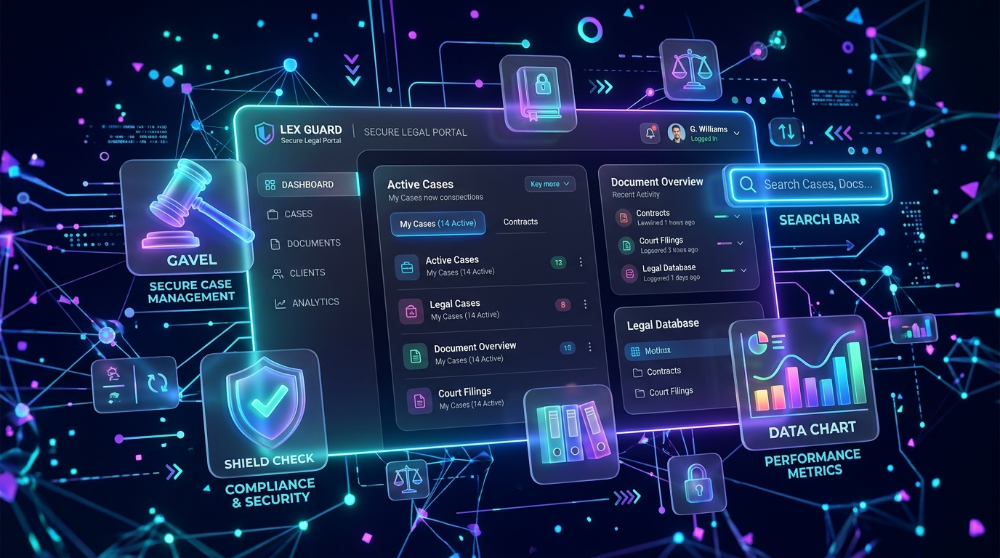

# 🏛️ Indian Legal Dataset & Audit Network Portal



[](https://fastapi.tiangolo.com)
[](https://reactjs.org)
[](https://vitejs.dev)
[](https://tailwindcss.com)
[](https://sqlite.org)

An enterprise-grade, high-performance legal indexing portal designed for researchers, reviewers, and system administrators. The portal streamlines raw PDF ingestion, extracts legal text metadata, audits quality checklists, and compiles interactive dashboards.

> 📄 **Executive Briefing & Client Presentation Guide**: A complete, 4-page publication-grade PDF whitepaper and client demo playbook is available at [`Indian_Legal_Dataset_Portal_Client_Guide.pdf`](./Indian_Legal_Dataset_Portal_Client_Guide.pdf) and [`reports/Indian_Legal_Dataset_Portal_Client_Guide.pdf`](./reports/Indian_Legal_Dataset_Portal_Client_Guide.pdf).

---

## 📂 Directories Architecture

```bash
Ai_Task_1/
├── client/                      # React + TypeScript Frontend (Vite)
│   ├── src/
│   │   ├── components/          # Reusable layout blocks (Navbar, Sidebar, PageHeader)
│   │   ├── pages/               # Sub-portal views (Dashboard, Documents, Quality, etc.)
│   │   ├── services/            # Axios API calls, auth services, request interceptors
│   │   └── types/               # Type declarations matching API schemas
│   └── public/                  # Static assets & 3D background mockups
└── server/                      # FastAPI Python Backend
    ├── app/
    │   ├── api/                 # Endpoint controllers (auth, documents, quality, etc.)
    │   ├── core/                # System settings, databases, websockets
    │   ├── models/              # SQLite SQLAlchemy models
    │   └── schemas/             # Pydantic validation schemas
    └── uploads/                 # Ingested PDF document binaries
```

---

## 🎨 Under the Hood: How & Why It Works

### 1. 🔍 Full-Text Search (FTS) Snippet Engine
* **The Mechanism**: The backend document route uses SQLite queries to search inside the `text_content` field. When a `search` string is active, the database locates the case-insensitive keyword index.
* **Why it works**: A custom regex boundary matcher locates the keyword offset within the document text. It extracts a `150` character context window (slicing text before and after the keyword) and prepends/appends `...` markers. This provides immediate matching context in the list view without downloading heavy PDF layers.

### 2. 🤖 Regex Legal Ingestion Auditor & Summarizer
* **The Mechanism**: On upload, `PyPDF2` reads the binary stream and extracts raw Unicode text. The server triggers a parser that matches legal patterns:
  * **Citations Pattern**: matches acts/statutes using regex dicts like `r"(Article\s+\d+|Section\s+\d+[A-Z]?\s+of\s+[^,\.]+)"`.
  * **Decision Pattern**: matches judgments outcomes using terms like `r"(petition\s+(allowed|dismissed)|appeal\s+succeeds)"`.
* **Why it works**: By generating a structured Markdown summary out-of-the-box, it isolates citations and legal provisions instantly. Researchers save hours scanning lengthy 50+ page judgments.

### 3. 👥 Dynamic RBAC Headers & Route Protection
* **The Mechanism**: To test portal views without logging out/in, the sidebar features a **User Role Switcher** dropdown. Changing roles saves the value to `localStorage.override_role`.
* **Why it works**: 
  * The Axios request interceptor dynamically forwards this key as `X-Override-Role` to the server, where backend dependencies override active database sessions.
  * A client-side router wrapper (`RoleGuard` in `App.tsx`) blocks manual URL traversal by verifying paths against the role's allowed route list, automatically redirecting intruders to the Home Dashboard.

### 4. 📌 WebSocket Live Invalidation Pipeline
* **The Mechanism**: When page annotations (Sticky Notes) are created or deleted, backend routers broadcast JSON events over WebSockets at `/api/ws` to all connected clients.
* **Why it works**: The client-side hook `useWebSocket.ts` listens to these broadcasts and triggers React Query cache invalidations. This refreshes document details panels automatically in real-time, syncing multiple researchers collaborating simultaneously.

---

## 📖 Sub-Portal User Guides (How to Use)

### 🔵 Researcher Portal (Workspace Entry)
* **Ingestion**: Click **Upload Document PDF** in the document collection page header. Upload files and fill in authority, categories, and years.
* **Citation Audits**: Select a document, and open the **AI Summary** tab on the details drawer. Review Acts cited (e.g. *Article 21*) and the final decision extracted from text patterns.
* **Research Annotations**: Click the **Sticky Notes** tab. Type a note, assign a Page Number, and click **Add Note**.
* **Global Search**: Type keywords into the search bar and verify highlighted text snippets appear in the list under document titles.

### 🟢 Reviewer Portal (Audit & Quality Gate)
* **Access Checks**: Access the **Quality Verification** sidebar link.
* **Verification Audits**: Toggle checklist benchmarks: *Official Source Mapped*, *Readable PDF*, *Complete Content*, *Metadata Correct*, *Version Control*, and *Duplicate Audited*.
* **Classification**: Designate the audit status (e.g. *Verified*, *Needs Review*, *Duplicate*) and save.
* **Safety Lock**: Try logging in as a Researcher and navigating to the verification panel. Notice inputs are disabled and cursor indicators are locked to `cursor-not-allowed` with a warning banner.

### 🟣 Administrator Portal (Telemetry Control Center)
* **Heatmaps**: Inspect case index coverage shade intensity in the **Ingested Datasets State Heatmap** card grid.
* **De-duplication**: Navigate to the **Duplicate Detection** page. Compare documents side-by-side to resolve conflicts (merge, keep, delete).
* **Source CRUD**: Navigate to **Sources Management** to create/edit/delete target official repositories.
* **Data Compiler**: Generate chronological index exports in the **Reports Compiler** panel.

---

## 🛠️ Step-by-Step Installation Guide

### 📋 Prerequisites
* **Node.js** (v18 or higher)
* **Python** (v3.9 or higher)

---

### 1. ⚙️ Backend Setup (FastAPI)
Navigate to the server directory and initialize environment dependencies:

```bash
# Go to server workspace
cd server

# Create a virtual environment
python -m venv venv
venv\Scripts\activate   # On Windows

# Install Python requirements
pip install -r requirements.txt

# Run the dev server
python -m uvicorn app.main:app --host 127.0.0.1 --port 8000 --reload
```
* **Host API**: `http://localhost:8000`
* **Swagger Docs**: `http://localhost:8000/docs`

---

### 2. 💻 Frontend Setup (Vite + React)
Navigate to the client directory and start the dev server:

```bash
# Go to client workspace
cd client

# Install package dependencies
npm install

# Start local server
npm run dev
```
* **Local Web Interface**: `http://localhost:5173`

---

## 🧪 Dev Sandbox Credentials
Prefilled on the login screen:
* **Researcher Workspace**: `researcher@legalportal.in` / `Password123`
* **Reviewer Panel**: `reviewer@legalportal.in` / `Password123`
* **Admin Center**: `admin@legalportal.in` / `Password123`
